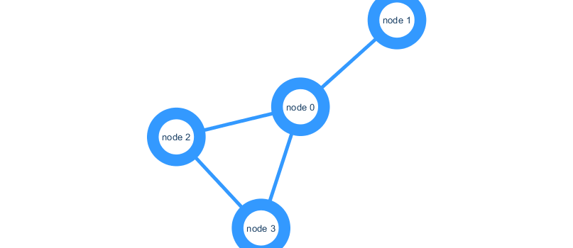
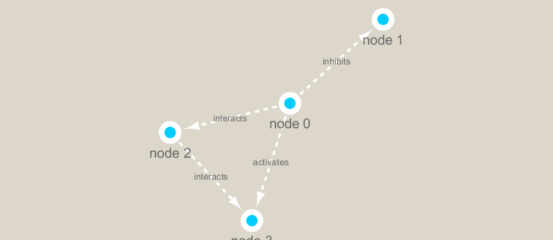

```{r}
library(RCy3)
library(igraph)
library(RColorBrewer)

cytoscapePing()
cytoscapeVersionInfo()
```

```{r}
g <- makeSimpleIgraph()

createNetworkFromIgraph(g,"myGraph")
setVisualStyle("Ripple")
fig <- exportImage(filename="demo", type="png", height=350)

```

```{r}
setVisualStyle("Marquee")
fig <- exportImage(filename="demo_marquee", type="png", height=350)


```

```{r}
prok_vir_cor <- read.delim("./virus_prok_cor_abundant.tsv", stringsAsFactors = FALSE)
head(prok_vir_cor)
g <- graph.data.frame(prok_vir_cor, directed = FALSE)
```

```{r}
class(g)
g
plot(g)
plot(g, vertex.label=NA)
plot(g, vertex.size=3, vertex.label=NA)
```

```{r}
library(ggraph)
ggraph(g, layout = 'auto') +
  geom_edge_link(alpha = 0.25) +
  geom_node_point(color="steelblue") +
  theme_graph()

```
```{r}
createNetworkFromIgraph(g,"myIgraph")
```
```{r}

cb <- cluster_edge_betweenness(g)
cb
```

```{r}
plot(cb, y=g, vertex.label=NA,  vertex.size=3)

```
```{r}
d <- degree(g)
hist(d, breaks=30, col="lightblue", main ="Node Degree Distribution")
```
```{r}
plot( degree_distribution(g), type="h" )
```
```{r}
pr <- page_rank(g)
head(pr$vector)
v.size <- BBmisc::normalize(pr$vector, range=c(2,20), method="range")
plot(g, vertex.size=v.size, vertex.label=NA)
```
```{r}
b <- betweenness(g)
v.size <- BBmisc::normalize(b, range=c(2,20), method="range")
plot(g, vertex.size=v.size, vertex.label=NA)
     
```

```{r}
phage_id_affiliation <- read.delim("./phage_ids_with_affiliation.tsv")
head(phage_id_affiliation)
bac_id_affi <- read.delim("./prok_tax_from_silva.tsv", stringsAsFactors = FALSE)
head(bac_id_affi)

genenet.nodes <- as.data.frame(vertex.attributes(g), stringsAsFactors=FALSE)
head(genenet.nodes)
length( grep("^ph_",genenet.nodes[,1]) )
```
```{r}
z <- bac_id_affi[,c("Accession_ID", "Kingdom", "Phylum", "Class")]
n <- merge(genenet.nodes, z, by.x="name", by.y="Accession_ID", all.x=TRUE)
head(n)
colnames(n)
colnames(phage_id_affiliation)
```


